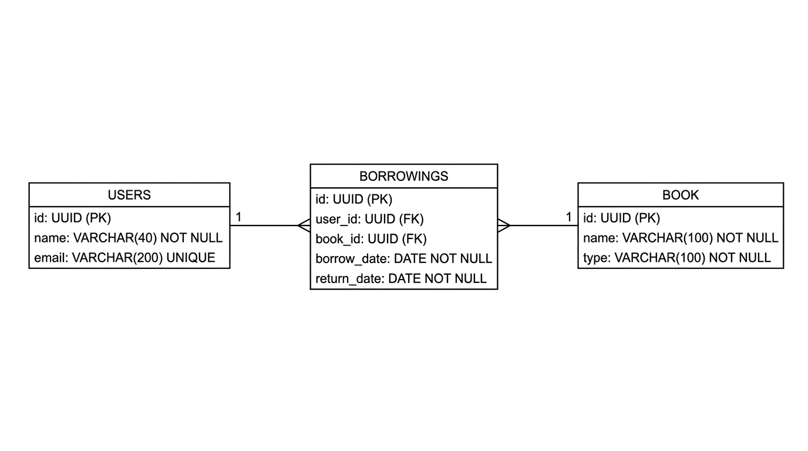

# Library Management Database

A relational database project for managing a library system using PostgreSQL.

The project models users, books, and borrowing operations, with proper relationships, primary keys, foreign keys, constraints, and SQL queries for retrieving useful information from the database.

## Project Overview

The database is designed to handle the main operations of a simple library system:

* Store library users.
* Store books and their categories.
* Record book borrowing operations.
* Connect users with the books they borrow.
* Query borrowing data using SQL joins, aggregation, filtering, and ordering.

## Database Schema

The database contains three main tables:

### Users

Stores information about library users.

| Column  | Type         | Description          |
| ------- | ------------ | -------------------- |
| `id`    | UUID         | Primary key          |
| `name`  | VARCHAR(40)  | User's name          |
| `email` | VARCHAR(200) | Unique email address |

### Book

Stores information about available books.

| Column | Type         | Description        |
| ------ | ------------ | ------------------ |
| `id`   | UUID         | Primary key        |
| `name` | VARCHAR(100) | Book name          |
| `type` | VARCHAR(100) | Book category/type |

### Borrowings

Stores book borrowing records.

| Column        | Type | Description                        |
| ------------- | ---- | ---------------------------------- |
| `id`          | UUID | Primary key                        |
| `user_id`     | UUID | Foreign key referencing `users.id` |
| `book_id`     | UUID | Foreign key referencing `book.id`  |
| `borrow_date` | DATE | Date when the book was borrowed    |
| `return_date` | DATE | Expected/recorded return date      |

## Relationships

The database uses foreign keys to represent the relationships between the tables.

* One user can have multiple borrowing records.
* One book can appear in multiple borrowing records.
* `borrowings.user_id` references `users.id`.
* `borrowings.book_id` references `book.id`.
* Both foreign keys use `ON DELETE CASCADE`.

Therefore, the relationship can be represented as:

```text
Users 1 ────────< Borrowings >──────── 1 Book
```

This creates a many-to-many relationship between users and books through the `borrowings` table.

## ER Diagram



## SQL Queries

The project includes practical SQL queries for working with the database, including:

* Joining users with their borrowing records.
* Retrieving users and the books they borrowed.
* Counting how many times each book was borrowed.
* Finding the user with the highest number of borrowings.
* Filtering borrowing records based on dates and book types.
* Using `JOIN`, `GROUP BY`, `COUNT`, `ORDER BY`, `LIMIT`, and `WHERE`.

All project SQL commands and queries are available in:

```text
library_system.sql
```

## Technologies

* PostgreSQL
* SQL
* UUID
* Relational Database Design
* ER Modeling

## Project Structure

```text
library-db-design/
│
├── README.md
├── library_system.sql
└── er-diagram.png
```

## Database Design Concepts

This project demonstrates practical understanding of:

* Primary Keys
* Foreign Keys
* UUIDs
* Unique Constraints
* NOT NULL Constraints
* One-to-Many Relationships
* Many-to-Many Relationships
* Junction Tables
* Referential Integrity
* `ON DELETE CASCADE`
* SQL Joins
* Aggregation
* `GROUP BY`
* `COUNT`
* `ORDER BY`
* `LIMIT`
* `WHERE`

## Learning Outcomes

Through this project, I practiced designing a relational database from requirements, converting an ER diagram into PostgreSQL tables, creating relationships using foreign keys, inserting realistic data, and writing SQL queries to retrieve and analyze the stored data.

## Author

**Ahmed Fouad**

Backend Development Learner | Python & PostgreSQL

